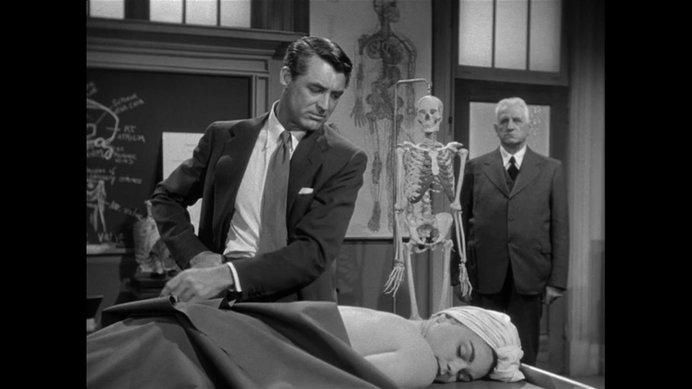

Configuring the quantified self
===============================

Idea
----
Configuring the quantified self starts from a 5 days workshop at [Relearn 2015 Brussels](http://relearn.be/2015/). The workshop track proposed to explore the functioning of social networks based on collected physical data, self tracking and health monitoring as they are expanding very much, and propose a very specific social context based on a quantified view of our bodies.

http://pad.constantvzw.org/p/data_games 

'The culturally con-structed body would be the result of a diffuse and active structuring of the social field. (Butler, 1989)'

Previous work
-------------
The 'configuring the quantified self' previous work  addresses a question of body quantification from two different starting critiques:
* the paradigm of 'fitness' apps and devices that track, record and interpret activity data to create quantified body as https://www.fitbit.com/
* 3D character mdoelling software that uses parametric techniques and complex mesh management to create 'humanoid' representations http://www.makehuman.org/

Both of these 'phenomena' are problematic in the sense that both systems create a mediated (digital) representation of the body. These representations are, necessarily reductive and are based on a very limited range of obviously quantifiable information. In the case of fitbit, the software, issues around health are presented as exclusively to do with 'physical' conditions such as activity and calorie consumption. Makehuman codifies particular body measurements into parametric sliders to create an illusion of infinite variety of form.

Both cases present a mode of quantification that is hugely difficult to accept - the fact that the means of quantification is fixed, static and 'global'. The user is not entitled to determine the type of extent of measurements that may be relevant and the user therefore has no agency in the process of quantification. This commonality is the starting point for the work - how can we explore the potential for 'self quantification'.

They also both lack something in terms of context - fitbit is a quantification without space and makehuman is a quantification without time.

'I never can catch myself at any time without a perception. (Hume Treatise)'

we have speculated on a kind of fitbit 'parody' that would, somehow, highlight the problems that we see in terms of data definition, collection and relation as well as interpretation and re-presentation through interfaces and devices.

Team
----
After a week spent together at relearn (20-25th august 2015 in BXL)  working on issues around alternative self tracking data and re-make human software we decided to tentatively answer the Sparks call as a collective team:
* Natacha Roussel
* Phil Langley
* [Anna Carreras](http://annacarreras.com/)

Anna Carreras
-------------
Anna Carreras (Barcelona, 1979) holds two MSc degrees, one in Telecommunication Systems Engineering from Universitat Politècnica de Catalunya and another in Information, Communication and Audiovisual Technologies from the Universitat Pompeu Fabra. She became a member of the Experimentation on Interactive Communication research group, focusing her work on the use of interactive technology (whole full-body interaction, tangible and embodied interfaces) as a means of communication and an experience generator. She has developed installations for several museums such as Cosmocaixa (Barcelona Science Museum), Expo Zaragoza or the Forum Barcelona 2004. She has also worked as Director of Technology at Cuatic, Ping Pong Technologies and Reactable Systems where she developed custom projects related to multitouch interfaces and music. She develops as freelance either comercial and artistic interactive projects.

----------

Dr Praetorius in People will talk directed by Joseph L. Mankiewicz 1951

Anatomy is more or less the study of the human body. The human body is not necessarily the human being. 
Here lies a cadaver. The fact that she was, not long ago, a living, warm, lovely young girl is of little consequence in this classroom.
You will not be required to dissect and examine the love that was in her — or the hate. All the hope, despair, memories and desires that motivated every moment of her existence. They ceased to exist when she ceased to exist. 
Instead, for weeks and months to come, you will dissect, examine and identify her organs, bones, muscles, tissues and so on, one by one. These you will faithfully  record in your notebooks and when the notebooks are filled, you will know all about this cadaver that the medical profession requires you to know.

