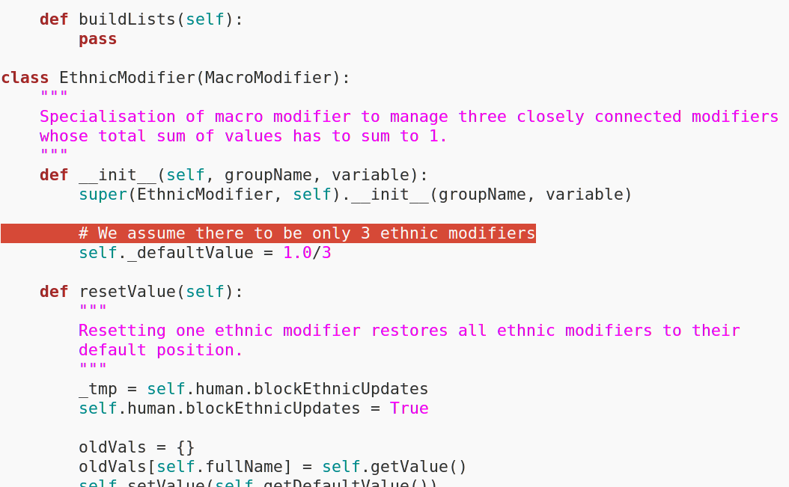

The body is an API – but who programs it?
-------------

Contemporary approaches to the 'body' in commercial digital technology are characterised by problematic notions of 'mind-less bodies' and 'body-less minds'. Our collaborative submission addresses the question of how to configure the 'quantified self'.

We approach this issue across two modes of body quantification;

- Disembodied data, passively generated by personal health devices, is processed and circulated in closed, hidden ways before finally being re-presented to us as an abstracted 'digital self' in the form of charts and graphs that measure our bodies value.
- Digital bodies modelled AS 3D meshes – created for gaming and animation - encourage quantified abstraction of body topologIES.  Accompanying parametric interfaces allowing 'flexibility' in the creation of 3D characters only encourages a pursuit of idealised body forms and fantasies.

Our proposition is to develop other (proto)types of digital devices, software and infrastructure that both reveal the complex flaws behind this current context as well as proposing alternative visions for what 'self quantification' might mean. These devices - a kind of '(digital) companion species' (Braidotti, Haraway, Hayles) - should emerge from a process of 'co-evolution' that is reflective of the variable agencies of software (Fuller, Mackenzie).

. . . 

*an extract from the source code of the character modelling software package 'MakeHuman'*

. . . 
